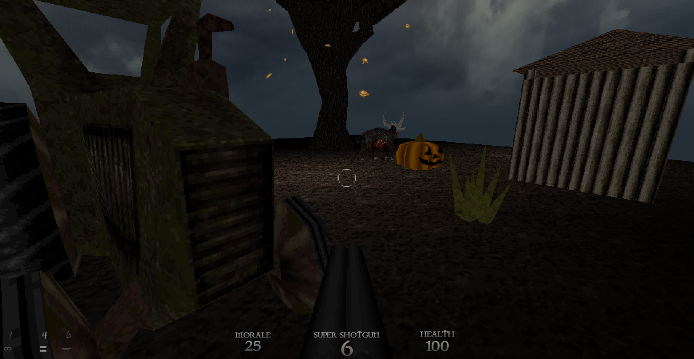

# dank - a mod for Dusk

`dank` is a mod for Dusk. All the tools needed for map compilation, map sources, and trenchbroom `fgd` file are included in the repo, so you can pretty much just clone into your `\SDK\mnt\local\dank` and modify and run. WADs not included. Grab them from the discord. 

